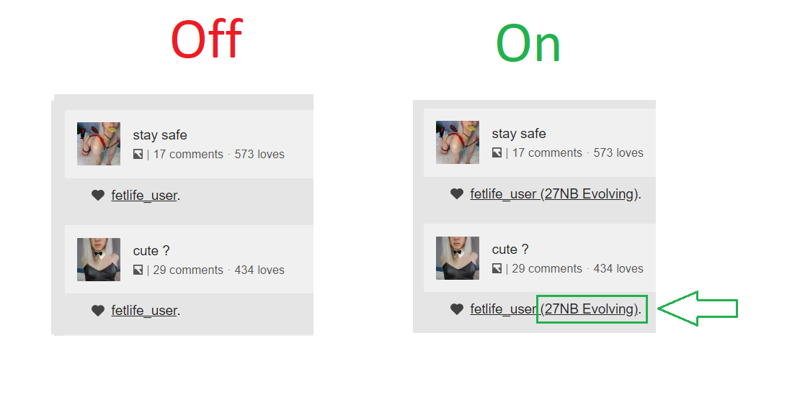

<h1 align="center" style="font-family: 'JetBrains Mono', monospace;">FetLife User Identity Enhancer</h1>

  

### What's This All About?

**FetLife User Identity Enhancer** is a neat little tool for your browser that makes your FetLife experience even better! If you've ever been curious about someone's identity while scrolling through FetLife, this plugin's for you. With just a simple setup, it adds a little hint next to every user's name, letting you know their identity, without you having to click into their profile. It's all about saving you time and making your browsing smoother.

### Why Would I Want This? 

- **Quick Glance**: No need to click on every profile. Get a glimpse of their identity straight away!
- **Seamless Experience**: It feels like a natural part of FetLife, so there's no learning curve.
- **Safe & Private**: We value privacy. The tool doesn’t keep any of your data; it just shows you a little extra info from profiles.

### How Do I Get Started?

Setting up is a breeze! Just follow these simple steps:

1. [Download link or method to add the extension to browser will be provided after approving this plugin by fetlife support.]
2. Navigate to FetLife and voilà! Enjoy your enhanced browsing experience.

### Will It Slow Down My Browsing?

Not at all! We've made sure it runs quietly in the background without eating up your memory or slowing things down.

### Need Help or Have Feedback?

We're always looking to improve. If you have suggestions, issues, or just want to chat about the plugin, reach out by adding issue to this repo C: 

---

Spread the word and enjoy a smarter FetLife experience! 🌟

--- 

Plugin created by 🐈[kitty_shark](https://fetlife.com/users/12429798)🦈 with lost of love to FetLife.com 🥰
